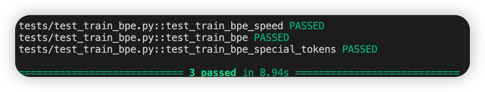

# CS336 Spring 2025 Assignment 1

## 这是CS336 作业一的仓库

## 使用uv来管理虚拟环境
略
### 下载数据
略


使用```source .venv/bin/activate```来选择虚拟环境.  

使用```uv add ipykernel```
在jupter中使用，

使用
```
uv run pytest tests/test_train_bpe.py
```
运行测试代码 
