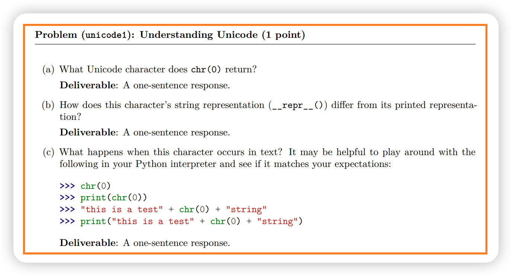
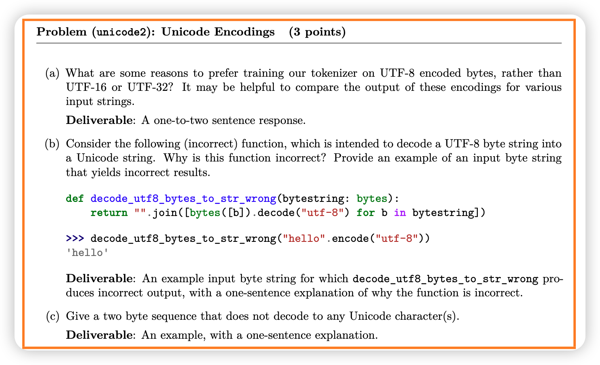

# CS336 Assignment 1 (basics): Building a Transformer LM
# 作业概览

在本次作业中，您将从零实现并训练一个标准的 Transformer 语言模型 (LM)。具体分为以下几部分：

## 您需要实现
1. 字节对编码 (BPE) 分词器 (§2)  
2. Transformer 语言模型 (§3)  
3. 交叉熵损失函数与 AdamW 优化器 (§4)  
4. 训练循环，支持模型和优化器状态的序列化与加载 (§5)  

## 您将运行
1. 在 TinyStories 数据集上训练 BPE 分词器  
2. 使用训练好的分词器将数据集转换为整型 ID 序列  
3. 在 TinyStories 数据集上训练 Transformer 语言模型  
4. 使用训练好的模型生成样本并评估困惑度 (perplexity)  
5. 在 OpenWebText 数据集上训练模型，并将获得的困惑度提交到排行榜  

## 可使用的工具
为保持“从零实现”的理念，除以下内容外，不得使用 `torch.nn`、`torch.nn.functional` 或 `torch.optim` 中的其他定义：  
- `torch.nn.Parameter`  
- `torch.nn` 中的容器类（例如 `Module`、`ModuleList`、`Sequential` 等）  
- `torch.optim.Optimizer` 基类  

其他 PyTorch 定义均可使用。如有疑问，请在 Slack 上询问。 

关于人工智能工具的声明：对于低级编程问题或关于语言模型的高级概念性问题，允许使用 ChatGPT 等 LLM 工具进行提示，但禁止直接使用它来解决问题。
我们强烈建议您在完成作业时在 IDE 中禁用人工智能自动完成功能（例如，Cursor Tab、GitHub CoPilot）（尽管非人工智能自动完成功能，例如自动完成函数名称，完全可以）。我们发现，人工智能自动完成功能会加大您深入理解内容的难度。
代码示例：所有作业代码以及本文均可在 GitHub 上找到：
github.com/stanford-cs336/assignment1-basics
请 git clone 该代码库。如有任何更新，我们会通知您，以便您使用 git pull 获取最新版本。
1. cs336_basics/*：这是您编写代码的地方。请注意，这里没有代码——您可以从头开始进行任何操作！
2. adapters.py：您的代码必须包含一组功能。对于每个功能（例如，缩放点积注意力机制），只需调用您的代码即可完成其实现（例如，run_scaled_dot_product_attention）。注意：您对 adapters.py 的更改不应包含任何实质性逻辑；这些代码属于胶水代码。
3. test_*.py：其中包含所有您必须通过的测试（例如，test_scaled_dot_product_attention），这些测试将调用 adapters.py 中定义的钩子函数。请勿编辑测试文件。
提交方式：您需要向 Gradescope 提交以下文件：
• writeup.pdf：回答所有书面问题。请排版您的答案。
• code.zip：包含您编写的所有代码。
要提交至排行榜，请将 PR 提交至：
github.com/stanford-cs336/assignment1-basics-leaderboard
有关详细的提交说明，请参阅排行榜代码库中的 README.md 文件。
数据集获取方式：本次作业将使用两个预处理数据集：TinyStories [Eldan and Li,
2023] 和 OpenWebText [Gokaslan et al., 2019]。这两个数据集都是单个大型纯文本文件。如果您与班级一起完成作业，您可以在任何非主节点机器的 /data 目录下找到这些文件。
如果您在家跟着做，可以使用 README.md 中的命令下载这些文件。

## tips
1
在课程的作业讲义中，我们会提供一些建议，帮助您在 GPU 资源较少或没有 GPU 资源的情况下完成部分作业。例如，我们有时会建议缩小数据集或模型规模，或者解释如何在 MacOS 集成 GPU 或 CPU 上运行训练代码。
您会在蓝色方框中找到这些“低资源技巧”（例如这个）。即使您是斯坦福大学的在校学生，可以使用课程机器，这些技巧也可能帮助您更快地迭代并节省时间，因此我们建议您阅读它们！
2
使用教职员工解决方案代码，我们可以在配备 36 GB RAM 的 Apple M3 Max 芯片上训练一个语言模型 (LM)，使其生成相当流畅的文本，在 Metal GPU (MPS) 上用时不到 5 分钟，在 CPU 上用时约 30 分钟。如果这些话对您来说没什么意义，别担心！只要记住，如果你有一台
相当先进的笔记本电脑，并且你的实现正确高效，你就能训练一个小型的
语言模型，能够以相当流畅的方式生成简单的儿童故事。
在作业的后面，我们会解释如果你使用的是 CPU 或 MPS，需要进行哪些更改。

## 2 字节对编码 (BPE) 分词器
在作业的第一部分，我们将训练并实现一个字节级的字节对编码 (BPE) 分词器 [Sennrich 等人，2016，Wang 等人，2019]。具体来说，我们将把任意 (Unicode) 字符串表示为字节序列，并在该字节序列上训练我们的 BPE 分词器。之后，我们将使用此分词器将文本（字符串）编码为分词器（整数序列），以进行语言建模。
2.1 Unicode 标准
Unicode 是一种将字符映射到整数代码点的文本编码标准。截至 Unicode 16.0（2024 年 9 月发布），该标准定义了 168 种文字的 154,998 个字符。例如，字符“s”的码位为 115（通常表示为 U+0073，其中 U+ 是常规前缀，0073 在十六进制中为 115），字符“牛”的码位为 29275。在 Python 中，可以使用 ord() 函数将单个 Unicode 字符转换为其整数表示形式。chr() 函数将整数 Unicode 码位转换为包含相应字符的字符串。

a：'\x00'
b：chr(0)的结果是'\x00'，(b) 该字符的字符串表示（repr()）与其打印表示有何不同？
chr(0) 是 NULL 字符，在大多数终端中不可见
repr() 的设计目的是让程序员能够看到对象的确切内容
print() 的目的是显示用户友好的输出
c： this is a teststring ，在字符串中隐身了。

## 2.2 Unicode 编码

虽然 Unicode 标准定义了从字符到代码点的映射（整数），但直接在 Unicode 代码点上训练分词器是不切实际的，因为词汇表会非常庞大（大约 150K 项）且稀疏（因为许多字符非常罕见）。相反，我们将使用 Unicode 编码，它将一个 Unicode 字符转换为一个字节序列。Unicode 标准本身定义了三种编码：UTF-8、UTF-16 和 UTF-32，其中 UTF-8 是互联网上主要的编码（所有网页中超过 98% 使用 UTF-8）。

UTF-8 是从 Unicode 码点（Code Point） 映射到 字节序列（Byte Sequence） 的。  在内存中，字符串最终也会以某种编码的字节序列形式存在，而 UTF-8 是目前非常常见和推荐的一种编码方式。

要将 Unicode 字符串编码为 UTF-8，我们可以使用 Python 中的 encode() 函数。要访问 Python bytes 对象的底层字节值，我们可以迭代它（例如，调用 list()）。最后，我们可以使用 decode() 函数将 UTF-8 字节字符串解码为 Unicode 字符串。
通过将我们的 Unicode 码点转换为字节序列（例如，通过 UTF-8 编码），我们本质上是在将一个码点序列（范围在 0 到 154,997 的整数）转换为一个字节值序列（范围在 0 到 255 的整数）。256 长度的字节词汇表更容易处理。在使用字节级分词时，我们不需要担心词汇表之外的标记，因为我们知道任何输入文本都可以表示为 0 到 255 的整数序列。问题（unicode2）：Unicode 编码（3 分）

该函数错误地假设每个字节都是独立的UTF-8字符，但UTF-8使用可变长度编码，多字节字符必须作为完整序列一起解码。

一个包含 10 个词的句子在词级语言模型中可能只有 10 个 token 长，但在字符级模型中可能长达 50 个或更多 token（取决于单词的长度）。处理这些更长的序列需要在模型的每一步进行更多的计算。此外，对字节序列进行语言建模是困难的，因为更长的输入序列会在数据中产生长期依赖关系。

子词分词是一种介于词级分词和字节级分词之间的方法。需要注意的是，字节级分词的词汇表包含 256 个条目（字节值范围从 0 到 255）。子词分词以更大的词汇表为代价，换取了输入字节序列更好的压缩效果。例如，如果字节序列 b'the'在我们的原始文本训练数据中频繁出现，将其作为一个条目添加到词汇表中，可以将这个 3 个分词的序列压缩为单个分词。

我们如何选择这些子词单元添加到我们的词汇表中？Sennrich 等人[2016]提出了使用字节对编码（BPE；Gage，1994），这是一种迭代地用一个新的未使用索引替换（合并）最频繁字节对的压缩算法。需要注意的是，该算法通过向我们的词汇表中添加子词分词来最大化输入序列的压缩效果——如果一个词在我们的输入文本中出现的频率足够高，它将被表示为一个子词单元。

基于 BPE 构建的词汇表的子词分词器通常被称为 BPE 分词器。在本作业中，我们将实现一个字节级 BPE 分词器，其中词汇项是字节或字节合并序列，这使我们能够在词汇表外处理和可管理的输入序列长度方面获得最佳效果。构建 BPE 分词器词汇表的过程被称为“训练”BPE 分词器。

2.3 子词分词

虽然字节级分词可以缓解词级分词面临的词汇表外问题，但将文本分词为字节会导致输入序列非常长。这会减慢模型训练速度，因为一个一个包含 10 个单词的句子在词级语言模型中可能只有 10 个 token 长，但在字符级模型中可能长达 50 个或更多 token（取决于单词的长度）。处理这些更长的序列需要在模型的每一步进行更多的计算。此外，对字节序列进行语言建模是困难的，因为更长的输入序列会在数据中产生长期依赖关系。

子词分词是词级分词和字节级分词之间的一个中间点。请注意，字节级分词的词汇表有 256 个条目（字节值范围是 0 到 255）。子词分词用更大的词汇表大小来换取输入字节序列更好的压缩效果。例如，如果字节序列 b'the'经常出现在我们的原始文本训练数据中，将其作为一个条目添加到词汇表中，可以将这个 3 个分词的序列减少为一个分词。

我们如何选择这些子词单元添加到我们的词汇表中？Sennrich 等人[2016]提出使用字节对编码（BPE；Gage，1994），这是一种压缩算法，它迭代地将出现频率最高的字节对替换为一个新未使用的索引。请注意，该算法通过添加子词分词到我们的词汇表来最大化输入序列的压缩效果——如果一个词在我们的输入文本中出现的次数足够多，它将被表示为一个单一的子词单元。

使用 BPE 构建词汇表的子词分词器通常被称为 BPE 分词器。在这个作业中，我们将实现一个字节级 BPE 分词器，其中词汇项是字节或字节合并序列，这让我们在处理未知词汇和可管理的输入序列长度方面都能获得最佳效果。构建 BPE 分词器词汇的过程被称为“训练”BPE 分词器。
## 2.4 BPE 分词器训练
词汇初始化 分词器词汇表是从字节串标记到整数 ID 的一对一映射。由于我们正在训练一个字节级 BPE 分词器，我们的初始词汇表仅仅是所有字节的集合。由于有 256 种可能的字节值，我们的初始词汇表的大小为 256。

预分词化 一旦你拥有词汇表，原则上你可以统计文本中字节相邻出现的频率，并从最频繁的字节对开始合并。然而，这相当计算密集，因为每次合并时我们都需要完整地遍历语料库。此外，直接跨语料库合并字节可能导致仅标点符号不同的标记（例如，dog! 与 dog.）。这些标记将获得完全不同的标记 ID，尽管它们可能在语义上高度相似（因为它们仅差标点符号）。

为了避免这种情况，我们对语料库进行预分词化。你可以将其视为对语料库的粗粒度分词，这有助于我们统计字符对出现的频率。例如，单词 'text' 可能是一个出现 10 次的预标记。在这种情况下，当我们统计字符 't' 和 'e' 相邻出现的频率时，我们会发现单词 'text' 中 't' 和 'e' 是相邻的，我们可以通过 10 次来增加它们的计数，而不是遍历语料库。由于我们正在训练基于字节的 BPE 模型，每个预标记都表示为 UTF-8 字节的序列。

Sennrich 等人[2016]的原始 BPE 实现通过简单地按空白字符分割进行预分词（即 s.split(" "））。相比之下，我们将使用基于正则表达式的预分词器（GPT-2 使用；Radford 等人，2019 年）